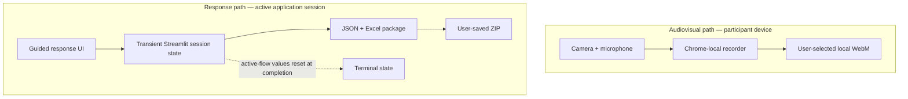

# Physical Stimulation Session Recorder

**A guided workflow for repeated, remotely supervised research sessions.**

Designed for participants completing physical-stimulation sessions with research-staff supervision, the prototype combines controlled entry, brief session context, browser-local audiovisual recording, stepwise structured responses, local export, and explicit completion gates. It aims to reduce missed steps and ambiguous adherence records without adding a media-upload path to the application.

> **Public-showcase scope.** All example media, study-facing prompts, and displayed values are synthetic; the interaction structure is a sanitized representation of the access-restricted prototype. This repository contains documentation and sanitized visual assets only. Operational source code, study-specific measures and access logic, credentials, and participant records remain access-restricted.

View the static workflow image

## What I Built

My contribution was the design and implementation of the participant-facing software workflow and this sanitized public documentation. The research team defined and governed the intervention protocol, study-specific measures, and participant procedures; none of those materials is reproduced here.

- Designed the end-to-end session journey and six explicit gates from entry through completion.
- Implemented a Chrome-based local recorder with device-readiness checks, browser-managed WebM saving, local playback-check instructions, and separate saved-file and no-save outcomes.
- Built the stepwise response flow and a session-scoped ZIP export with corresponding JSON and Excel views generated from the same session snapshot.
- Defined the data-handling and cleanup boundaries among browser-local media, transient response state, and user-controlled downloads.
- Created the synthetic walkthrough and sanitized visual documentation so the interaction can be reviewed without exposing study-specific content.

## Guided Workflow

| Stage | Purpose | Complete when |
| --- | --- | --- |
| **01 · Controlled entry** | Establish the configured supervised-session context | Configured entry is accepted |
| **02 · Daily context** | Capture the minimum context required for the session | Required context is complete |
| **03 · Browser-local recording** | Record and review camera video plus microphone audio in Chrome | User attests the local WebM outcome |
| **04 · Stepwise response** | Present one required response step at a time | Required and applicable steps are complete |
| **05 · Local response package** | Generate JSON and Excel views in one ZIP | User attests that the ZIP was saved locally |
| **06 · Completion** | Record the stated outcomes and close the active flow | Active-flow response and export values are reset |

The public walkthrough condenses adjacent interactions and replaces research measures with invented usability prompts. It demonstrates the interaction pattern; the table documents all six prototype completion gates.

## Interface Walkthrough

The images below come from the synthetic public walkthrough; the accompanying text describes the corresponding behavior in the access-restricted prototype.

### Browser-Local Recording

View the static recorder image

The current Chrome implementation checks camera and microphone readiness, shows a muted preview, records WebM media, and provides local playback-check instructions. Depending on the selected mode, recording data are either buffered for a user-initiated download or written directly to a user-selected local file. The implemented application path does not send media bytes to the Streamlit server.

Interrupted or unfinished local recordings may be incomplete. The UI records either the user's confirmation that a local file was saved or an explicit no-save outcome. These are user attestations; the application does not inspect the local file system or verify file integrity.

### Stepwise Structured Responses

The public walkthrough uses four invented usability prompts to demonstrate one-at-a-time controls, progression, and required-step completion. In the prototype, applicable branches appear only when needed, and study-specific measures remain access-restricted.

### Local Response Package

The prototype generates one user-downloaded ZIP containing corresponding JSON and Excel views of the same session snapshot. The UI records the user's confirmation that the ZIP was saved locally; it does not inspect the local file system.

### Completion Confirmation

The final action records the stated recording and response-package outcomes, removes the active workflow's response and export values from application-managed session state, leaves a minimal terminal completion marker, and closes the guided flow.

## Data Flow and Privacy Boundary

- In the current implementation, audiovisual data are handled by the recorder in Chrome and written to a user-selected local WebM. The implemented application path does not send media bytes to the Streamlit server.
- Response values are held in Streamlit's server-side session state during the active flow to manage progression and generate the download package. Corresponding JSON and Excel views are generated from the same session snapshot.
- The prototype does not intentionally write response values to an application database or file-backed server store. Browser, runtime, and hosting-platform retention are outside this showcase's claims.
- Completion removes the workflow-owned response and export values from application-managed session state. This does not claim memory zeroization or deletion of browser, runtime, or hosting-platform logs.
- Local-save and playback checks are user attestations, not automatic file-system inspection or integrity verification.

## Evidence Boundary

This repository provides synthetic visual evidence of the interaction pattern. Statements about the access-restricted implementation are implementation documentation; because the operational source is not public, they are not independently executable or verifiable from this repository alone.

| Shown in synthetic assets or documented about the prototype | Not established by this showcase |
| --- | --- |
| Guided progression and explicit completion gates | Clinical effectiveness |
| Browser-local media handling and user-initiated local saving | Independent public source-code or privacy/security audit |
| Local response-package generation and active-flow state reset | Automatic verification of files on the user's device or platform-retention guarantees |
| A supervised research-prototype workflow | Unsupervised deployment readiness or privacy/security certification |

## Project Status

**Active research prototype.** Participant sessions remain governed by supervised study procedures. This tool is not a clinical product or the authoritative intervention protocol. The implementation remains access-restricted and is being developed as reusable research infrastructure for guided sessions, browser-local recording, structured responses, and local data packaging.

中文简介

本项目面向研究人员监督下的重复性远程物理刺激研究会话，将受控进入、当日状态、本地音视频录制、分步结构化作答、本地资料包与完成确认组织为一条清晰流程。

我负责参与者端软件流程、数据处理边界及脱敏公开展示的设计与实现；研究团队负责干预方案、研究专用量表和参与者流程。本仓库只包含合成界面与脱敏素材，不公开运行源码、研究专用内容、凭证或参与者记录。

录像保存在用户选择的本地 WebM 中，当前实现未设置向 Streamlit 服务器上传媒体的应用路径。页面中的本地保存与回放确认均为用户自我确认，系统不会自动检查本地文件或保证浏览器、运行环境与托管平台日志被删除。

