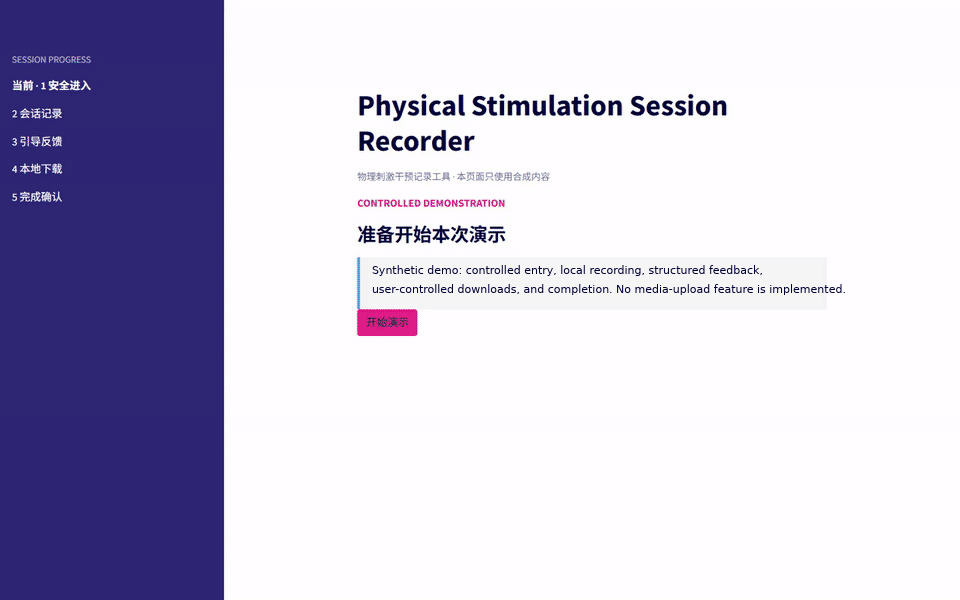
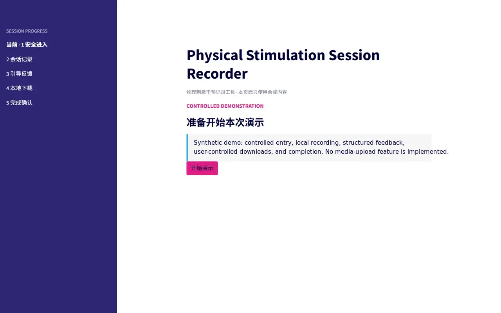
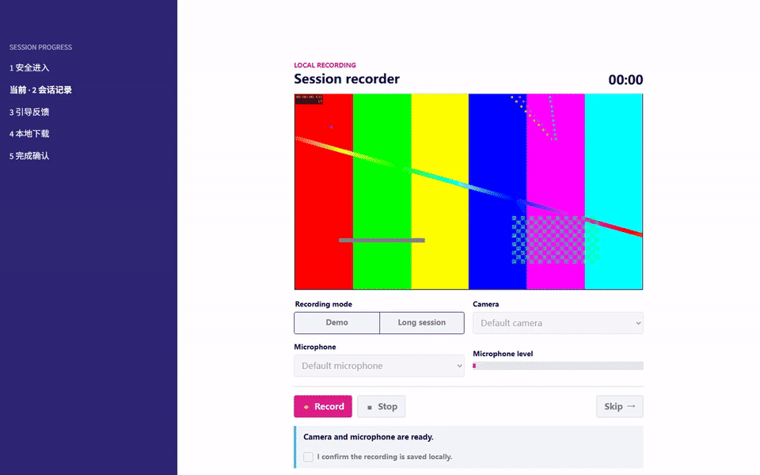
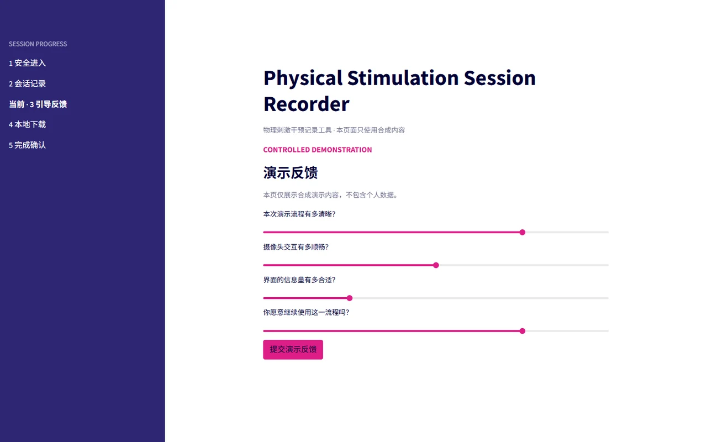
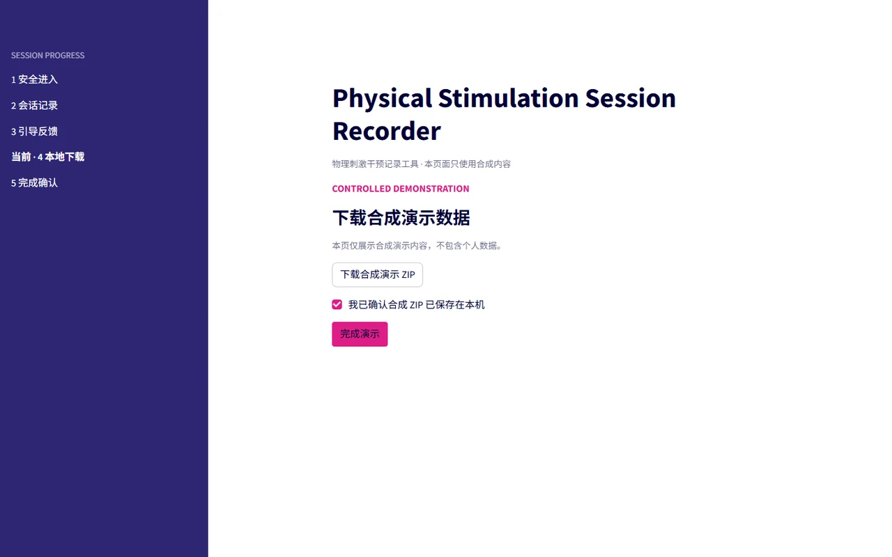
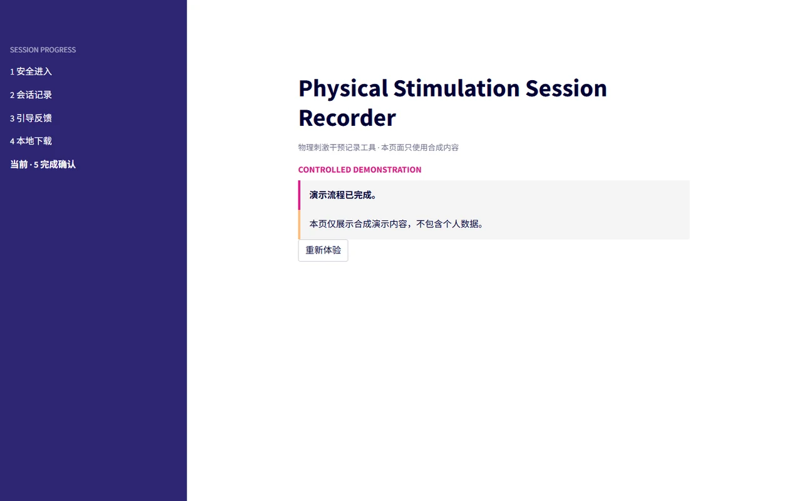
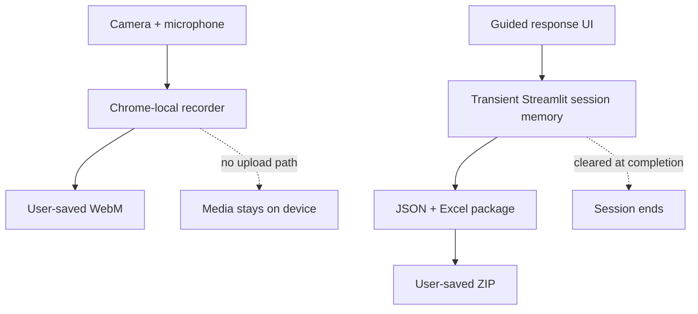

# Physical Stimulation Session Recorder

**Sanitized public showcase · 脱敏公开展示**

This repository is a documentation-only, sanitized public showcase of a private prototype for supervised research sessions. All interface content and values shown here are synthetic; operational source, study-specific measures and access logic, credentials, and participant records are not included.

The prototype brings controlled entry, brief daily context, browser-local audiovisual recording, stepwise structured responses, local export, and completion confirmation into one guided workflow. The design aims to reduce missed steps and ambiguous completion states without centralizing sensitive audiovisual data.

本仓库是该研究工具的脱敏公开展示。所有界面内容与数值均为合成示例；研究专用量表、访问逻辑、运行源码、凭证和参与者记录均不在公开范围内。

Static workflow image / 静态流程图

## What I Built · 我的工作

Across the underlying access-restricted prototype and this public showcase, I:

- Designed the guided session journey and explicit completion gates across entry, recording, response, export, and closure.
- Implemented a Chrome-based local recorder with device-readiness checks, WebM playback, and separate save and no-save confirmation paths.
- Built the stepwise response flow and a session-scoped JSON + Excel export package with explicit local-save confirmation.
- Defined the data-cleanup and privacy boundaries between browser media, transient response state, and user-controlled downloads.
- Created a synthetic demonstration and sanitized visual documentation so the interaction can be reviewed without exposing study-specific content.

## Guided Workflow · 引导式流程

The underlying prototype uses six explicit completion gates:

| Stage | Purpose | Completion signal |
| --- | --- | --- |
| **Controlled entry / 受控进入** | Establish the authorized session context | Entry accepted |
| **Daily context / 当日状态** | Capture the minimum context required for the session | Required context complete |
| **Browser-local recording / 本地音视频** | Record and review camera video plus microphone audio in Chrome | Local WebM checked, or no-save path confirmed |
| **Stepwise response / 分步作答** | Present one required response step at a time | Required steps complete |
| **Local response package / 本地资料包** | Generate equivalent JSON and Excel records in one ZIP | Local ZIP save confirmed |
| **Completion / 完成确认** | Confirm local outcomes and close the active flow | Application-owned session state cleared |

The public walkthrough groups adjacent interactions into a shorter screen sequence and replaces all research measures with invented usability prompts. It illustrates the visible interaction pattern; the table above documents the corresponding completion gates, and the sections below describe their data boundaries.

## Interface and Interaction · 界面与交互

### Browser-local Recording · 浏览器本地录制

Static recorder image / 静态录制图

In the underlying private implementation, the desktop Chrome workflow provides camera and microphone readiness, a muted preview, a recording timer, local playback, and an explicit outcome confirmation.

- Media is recorded in the browser and saved through a user-controlled WebM download.
- The application has no media-upload path.
- A saved-file confirmation is kept distinct from the explicit no-save path, so skipped or unavailable recording is never represented as saved media.
- Confirmation records the user's check; it does not automatically inspect the local file system.

### Stepwise Structured Response · 分步结构化作答

The public walkthrough uses four invented usability prompts to demonstrate focused controls, progression, and required-step completion. In the underlying private implementation, content is presented one step at a time, applicable branches appear only when needed, and study-specific measures remain access-restricted.

### Local Response Package · 本地资料包

In the underlying private implementation, response values remain in transient Streamlit session memory while one local package is generated. The ZIP contains equivalent JSON and Excel representations and is saved through a user-controlled browser download. The prototype does not use a durable response store.

### Completion Confirmation · 完成确认

In the underlying private implementation, the final state confirms the recording outcome and local response-package save, clears application-owned session state, and provides an unambiguous end to the guided flow.

## Method and Data Boundary · 方法与数据边界

- Camera and microphone bytes remain in Chrome and are saved only through a user-controlled local action.
- Synthetic response values enter transient server-side session memory only to generate the local package and are cleared with the session lifecycle.
- Public screenshots and animations use generated media, invented responses, and no participant identifiers.
- This repository contains documentation and sanitized visual assets—not application source, credentials, study-specific materials, or participant records.

## Evidence Boundary · 证据边界

| Shown or documented in this showcase | Deliberately not claimed |
| --- | --- |
| Guided progression and explicit completion gates | Clinical effectiveness |
| Browser-local recording and user-controlled download | Unsupervised deployment readiness |
| Synthetic structured responses and local JSON + Excel export | Automatic verification of files on the user's device |
| Documented privacy and session-cleanup boundaries | Public availability of operational source or research measures |

## Project Status · 项目状态

**Active research prototype.** The underlying implementation remains access-restricted, and participant sessions remain governed by supervised research procedures. This tool is not a clinical product or the authoritative intervention protocol. It is being developed as reusable research infrastructure for guided sessions, browser-local recording, structured responses, and local data packaging.
