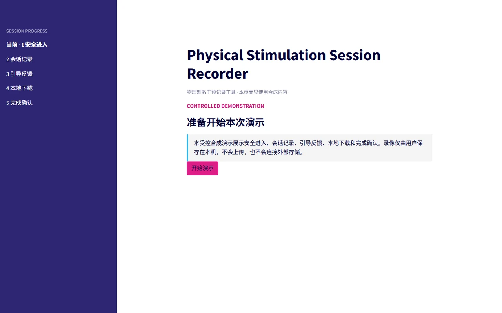
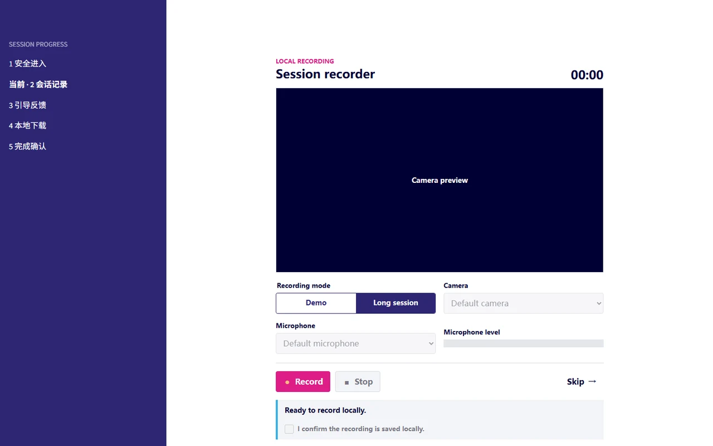
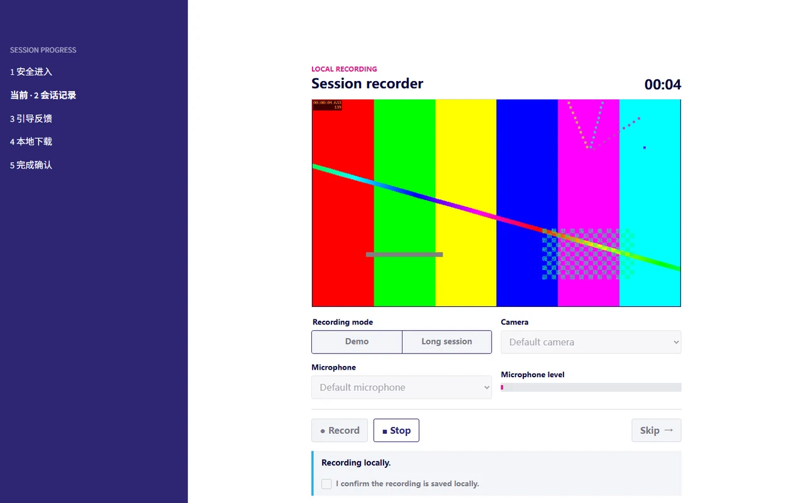
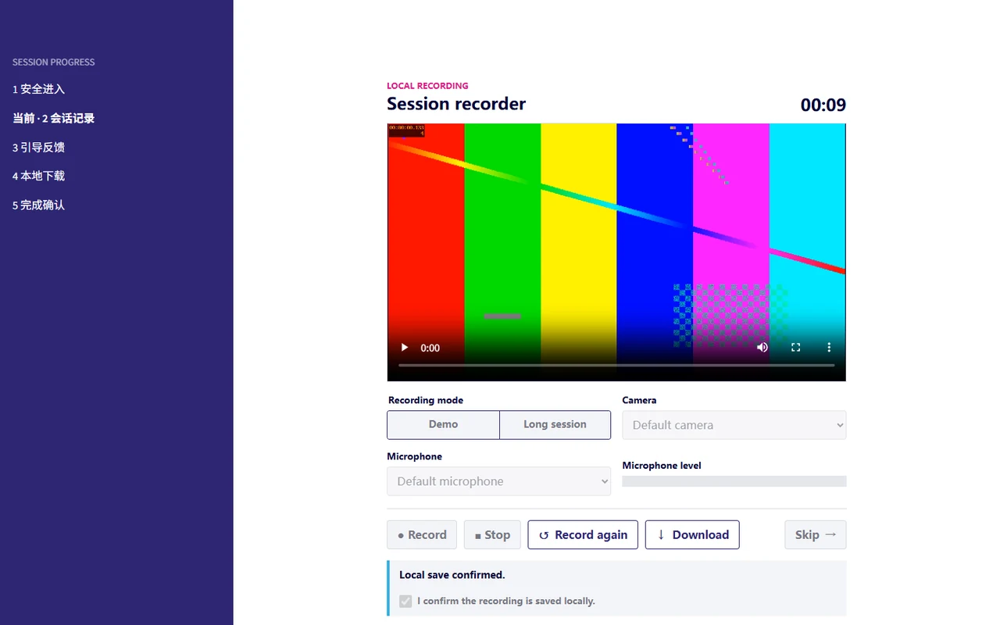
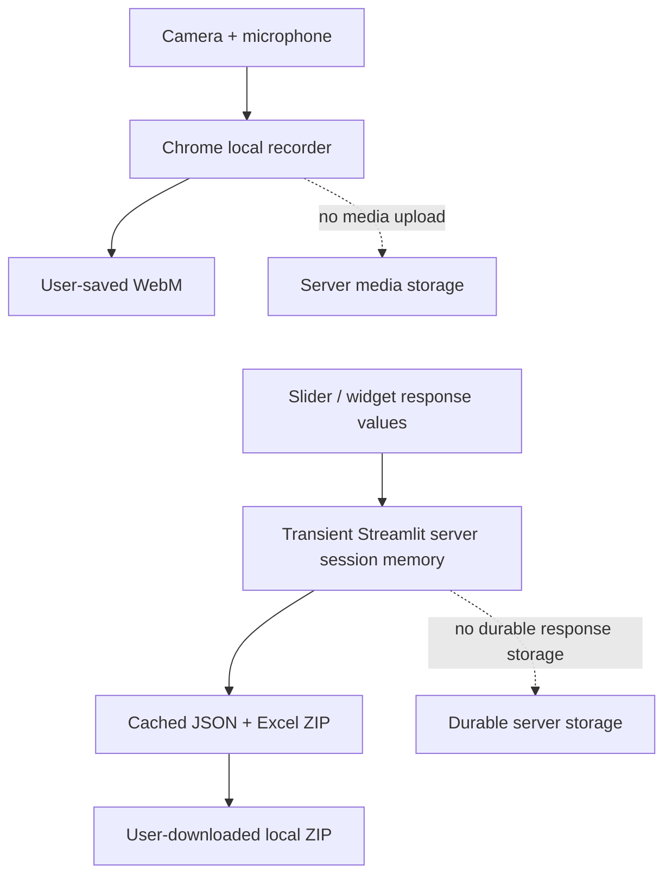

# Physical Stimulation Session Recorder

A Chrome-first session recorder with explicit local saves, a synthetic public walkthrough, and a visible privacy boundary. Chrome 优先的会话记录工具，以清晰的本地保存步骤、合成演示内容和明确的隐私边界为核心。

- **Chrome-local audio + video / Chrome 本地音视频** - camera and microphone recording stays in the browser.
- **Local JSON + Excel responses ZIP / 本地 JSON + Excel 作答 ZIP** - one browser download provides both formats.
- **No media upload; no durable response storage / 媒体不上传；作答资料不持久存储** - media bytes stay in Chrome; response values and the cached ZIP use transient Streamlit server session memory, not durable server storage.

[Open the static workflow fallback / 查看静态流程图](assets/workflow-demo-static.webp)

## 体验概览 | Experience Overview

The public demonstration uses a generated camera test scene, synthetic audio, and invented slider responses. It shows the complete interaction without exposing real session content: confirm access, prepare devices, record and save locally, complete synthetic feedback, download the JSON + Excel ZIP, confirm both local saves, and finish.

公开演示只使用生成的测试画面、合成音频与虚构的滑杆回应，用于呈现操作节奏与成功状态。

## 九步流程 | Nine-Step Walkthrough

### 1. 确认受控进入 | Confirm Controlled Access

**Action / 操作:** Complete the separately managed access step and enter the demonstration.

**Success / 完成:** The page shows **Controlled access confirmed** and the start command is available.

### 2. 浏览流程概览 | Review the Overview

**Action / 操作:** Read the neutral workflow summary, then choose **Start demonstration**.

**Success / 完成:** The progress rail shows the recording stage as the next active part of the session.

### 3. 允许设备并检查状态 | Allow Devices and Check Readiness

**Action / 操作:** Allow Chrome to use the camera and microphone; confirm the generated preview and microphone meter respond.

**Success / 完成:** The recorder reports **Camera and microphone are ready**.

### 4. 选择录制模式 | Choose a Recording Mode

**Action / 操作:** Select **Demo** for a short in-memory recording or **Long session** for direct writing to a chosen local file.

**Success / 完成:** The selected mode is visibly highlighted before recording starts.

### 5. 开始并观察录制 | Record and Monitor

**Action / 操作:** Choose **Record**, watch the timer, preview, and microphone level, then choose **Stop** when finished.

**Success / 完成:** The status reads **Recording locally** while the timer advances.

### 6. 保存本地视频 | Save the Local Video

**Action / 操作:** In demo mode, review the local playback and choose **Download**. In long mode, stop cleanly so Chrome can finalize the selected file. Verify playback and audio, then check the local-save confirmation.

**Success / 完成:** The recorder reports **Local save confirmed** and releases the recording devices.

### 7. 提交合成反馈 | Submit Synthetic Feedback

**Action / 操作:** Move the four invented feedback sliders and submit the demonstration feedback.

**Success / 完成:** The workflow advances to local download without showing a score or answer summary.

### 8. 下载本地 ZIP | Download the Local ZIP

**Action / 操作:** Download the synthetic ZIP, verify that it is present locally, and check the confirmation box.

**Success / 完成:** The finish command becomes available after local-save confirmation.

### 9. 完成本次流程 | Finish the Session

**Action / 操作:** Choose **Finish demonstration** only after confirming the video and ZIP are both stored locally.

**Success / 完成:** A privacy-safe completion message appears, with a separate command to restart.

## 本地录制 | Local Recording

[Open the static recorder fallback / 查看静态录制图](assets/local-recording-static.webp)

Chrome creates a **WebM file with camera video and microphone audio**. The mode changes how those bytes reach local storage:

### Demo / 演示

- **Limit / 上限:** 5 minutes / 5 分钟
- **Save behavior / 保存方式:** Keeps recording chunks in browser memory. After a clean stop, review local playback and choose **Download**. / 录制片段暂存在浏览器内存中；正常停止后先检查本地回放，再选择 **Download** 下载。
- **Best use / 适合:** Short checks and demonstrations. / 适合短时检查与演示。

### Long session / 长时段

- **Limit / 上限:** 45 minutes / 45 分钟
- **Save behavior / 保存方式:** Opens Chrome's local file picker before recording and writes chunks directly to the chosen file; a clean stop closes and finalizes it. / 开始前由 Chrome 选择本地文件，录制片段直接写入该文件；正常停止后完成关闭与定稿。
- **Best use / 适合:** Longer sessions with lower browser-memory pressure. / 适合较长时段，并降低浏览器内存压力。

The recorder stops automatically at the selected mode's limit. In either mode, confirm the saved WebM exists and plays with audio before continuing. Demo-mode content is lost if the tab refreshes or closes before download. Long-mode output can be incomplete or unplayable after a browser crash, power loss, device disconnect, failed write, or interruption before finalization; do not treat a partial file as a completed recording.

达到所选模式的时限后，录制会自动停止。继续前请确认 WebM 已保存，并能正常播放画面与声音。演示模式在下载前刷新或关闭标签页会丢失内容；长时段模式若在定稿前遇到浏览器崩溃、断电、设备断开或写入失败，文件可能不完整或无法播放，不能视为已完成录制。

## 本地导出 | Local Export

After the synthetic sliders are complete, their response values are transmitted to Streamlit and held in **transient server-side session memory**. The application builds and caches one ZIP in that session; it contains equivalent **JSON and Excel** representations and remains available through download and local-save confirmation. It is separate from the WebM and must be saved and checked separately.

完成合成滑杆后，回应值会传送给 Streamlit，并暂存在**服务器端会话内存**。应用会在该会话中生成并缓存一个 ZIP，其中包含等价的 **JSON 与 Excel** 内容，并在下载及本地保存确认期间保留。ZIP 与 WebM 相互独立，必须分别保存并检查。

- Keep the tab open through ZIP download and local-save confirmation. / 在 ZIP 下载及本地保存确认完成前保持标签页开启。
- Open the archive locally and confirm that both JSON and Excel files are present. / 在本机打开压缩包，确认 JSON 与 Excel 文件均存在。
- Check the ZIP local-save confirmation only after locating the file. / 找到本地文件后再勾选 ZIP 保存确认。
- Finish the session only after both the WebM and ZIP checks are complete. / 仅在 WebM 与 ZIP 均检查完成后结束本次流程。

Response values and the cached ZIP are not written to durable server disk or storage. Choosing **Finish** opens the completion screen but does not clear this transient session state; it remains until **Restart**, a return to the overview, or Streamlit session termination. Closing or refreshing early can terminate the current session, so recovery is not guaranteed. The application cannot verify a local disk write automatically; each checkbox records the user's confirmation, not an automatic file-system check.

回应值与缓存 ZIP 不会写入服务器持久磁盘或存储。选择 **Finish** 只会进入完成画面，不会清除这些临时会话内容；选择 **Restart**、返回概览或 Streamlit 会话终止时才会清除。提前关闭或刷新页面可能导致当前会话终止，因此无法保证恢复。应用无法自动核验本地磁盘写入，因此每个复选框只记录用户确认，并非文件系统自动检查。

## 隐私边界 | Privacy Boundary

Media bytes remain in Chrome, are saved only through a user-controlled local action, and are never uploaded. Slider and widget values are transmitted to Streamlit and held in transient server-side session memory together with the cached export ZIP through the completion screen. Neither the values nor the ZIP are written to durable server storage. **Finish does not clear them**; they are cleared on **Restart**, return to the overview, or Streamlit session termination.

媒体字节始终留在 Chrome 中，仅通过用户操作保存到本机，绝不上传。滑杆与控件回应值会传送至 Streamlit，并与缓存导出 ZIP 一同暂存在服务器端会话内存，且会保留到完成画面；这些内容不会写入服务器持久存储。**Finish 不会清除它们**，选择 **Restart**、返回概览或 Streamlit 会话终止时才会清除。

**Participant scores are neither displayed nor included.** The downloaded package contains raw responses, not calculated totals, interpretations, thresholds, or risk labels. Public images contain no real questionnaire content, participant identifiers, or real session values.

## Chrome 使用指南 | Chrome Guide

1. **Open the controlled demonstration / 打开受控演示。** Use a current desktop Chrome window. Access details are shared separately by the demonstration owner. / 使用当前版本的桌面 Chrome；进入信息由演示负责人另行提供。
2. **Enter the recording step / 进入录制步骤。** Choose **Start demonstration**, then continue to the session recorder. / 选择 **Start demonstration**，进入会话录制器。
3. **Grant device permissions / 允许设备权限。** When Chrome asks, allow camera and microphone access for this session. Wait for the generated preview and the ready status. / Chrome 提示时允许本次会话使用摄像头与麦克风，等待生成画面和就绪状态出现。
4. **Select and test devices / 选择并测试设备。** Choose the intended camera and microphone. Speak briefly and confirm that the microphone meter moves; use the preview to confirm the camera source. / 选择所需摄像头与麦克风，短暂发声确认音量条有变化，并通过预览确认画面来源。
5. **Choose a mode before recording / 录制前选择模式。** Use **Demo** for up to five minutes in memory. Use **Long session** for up to 45 minutes written directly to a local file; select the destination when Chrome asks. / **Demo** 最长 5 分钟并暂存在浏览器内存；**Long session** 最长 45 分钟并直接写入本地文件，按 Chrome 提示选择保存位置。
6. **Record and stop cleanly / 开始并正常停止。** Choose **Record**, confirm the timer advances, then choose **Stop** once. Wait for finalization before leaving the page or changing devices. / 选择 **Record**，确认计时器前进，结束时只选择一次 **Stop**；定稿完成前不要离开页面或更换设备。
7. **Verify the local WebM / 检查本地 WebM。** In demo mode, play the result and choose **Download**. In long mode, locate the destination selected before recording. Confirm both video and audio playback, then check the video local-save box. / 演示模式先回放再选择 **Download**；长时段模式找到录制前选定的文件。确认画面与声音均可播放后，再勾选视频本地保存确认。
8. **Complete the synthetic response step / 完成合成作答步骤。** Adjust the invented sliders and submit. This public flow contains no real question content and displays no score. / 调整虚构滑杆并提交；公开流程不含真实问题内容，也不显示分数。
9. **Download the response package / 下载作答数据包。** Download the JSON + Excel ZIP, find it in Chrome's download list or the chosen download location, and confirm that both formats are present. / 下载 JSON + Excel ZIP，在 Chrome 下载列表或所选位置找到文件，并确认两种格式均存在。
10. **Confirm and finish / 确认并结束。** Check the ZIP local-save box, choose the finish command, and wait for the completion screen. Response values and the cached ZIP remain in transient server session memory after **Finish**. / 勾选 ZIP 本地保存确认，选择结束命令并等待完成画面；选择 **Finish** 后，回应值与缓存 ZIP 仍保留在临时服务器会话内存中。
11. **Restart only when needed / 仅在需要时重新开始。** Use the restart command for a new synthetic run. A restart clears the current demonstration state, so first verify every required local file. / 使用重新开始命令进入新的合成流程；该操作会清除当前演示状态，因此请先检查所有必需的本地文件。

Chrome releases the camera and microphone after a recording is finalized, skipped, failed, or reset. Before using the devices elsewhere, wait for the recorder to settle; after local files are verified, close the demonstration tab if Chrome still shows a device indicator.

录制定稿、跳过、失败或重置后，Chrome 会释放摄像头与麦克风。在其他应用使用设备前请等待录制器完成处理；确认本地文件后，若 Chrome 仍显示设备使用标记，请关闭演示标签页。

## 故障排查 | Troubleshooting

- **Controlled access is unavailable / 无法进入受控演示** - request current access details from the demonstration owner. No access secret is included here. / 向演示负责人索取当前进入信息；此处不提供任何进入密钥。
- **Camera or microphone permission was denied / 摄像头或麦克风权限被拒绝** - open Chrome's site controls, allow both devices, then reload and restart the synthetic flow. Do not disable browser security protections. / 在 Chrome 站点控制中允许两个设备，重新加载并开始新的合成流程；不要关闭浏览器安全保护。
- **A camera or microphone is missing or busy / 设备缺失或正被占用** - close other meeting, camera, or audio applications, reconnect the device, select it again, and retry a short test. / 关闭其他会议、摄像或音频应用，重新连接并选择设备，再进行短时测试。
- **The preview works but audio is missing / 有预览但没有声音** - select the intended microphone, check the operating system input level, and confirm the on-page meter moves before recording. Make a short demo recording and verify its playback audio. / 选择正确麦克风，检查系统输入音量，并在录制前确认页面音量条有变化；先录制短片并检查回放声音。
- **The long-mode file picker was cancelled / 已取消长时段文件选择** - no recording starts. Choose **Record** again and select a writable local destination when ready. / 此时录制不会开始；准备好后再次选择 **Record**，并选择可写的本地位置。
- **A disk or write operation fails / 磁盘或写入失败** - confirm free space and write access, choose a different approved local destination, and begin a new recording. Do not rely on the failed or partial file. / 检查可用空间和写入权限，改用其他获准的本地位置并重新录制；不要依赖失败或残缺文件。
- **A file is incomplete after interruption / 中断后文件不完整** - demo-mode bytes may be lost before download, while long-mode bytes may not be finalized. Do not rely on the partial file; start a new recording and stop cleanly. / 演示模式可能在下载前丢失内容，长时段文件可能尚未定稿；不要依赖残缺文件，请重新录制并正常停止。
- **The WebM download is missing / 找不到 WebM 下载** - keep the tab open, return to the stopped result, and retry **Download**. Check Chrome's download list before recording again. / 保持标签页开启，返回已停止的结果并重试 **Download**；重新录制前先查看 Chrome 下载列表。
- **The ZIP does not download / ZIP 未下载** - keep the current session open and use the available retry action. A third-party download manager may take over the browser download; check its download list or temporarily disable takeover and retry. / 保持当前会话开启并使用重试操作。第三方下载管理工具可能接管浏览器下载；请查看其下载列表，或暂时关闭接管后重试。
- **A save picker or download was dismissed / 已关闭保存窗口或下载** - repeat the same download action. Do not check local-save confirmation until the file is visible locally. / 重复相同下载操作；在本机看到文件前不要勾选本地保存确认。
- **Devices remain active / 设备仍处于启用状态** - wait for finalization, then use **Record again**, restart, or close the tab after verifying local files. Reopen other device-using applications only after Chrome releases the tracks. / 等待定稿完成；确认本地文件后再使用 **Record again**、重新开始或关闭标签页。Chrome 释放设备轨道后再打开其他相关应用。
- **Chrome reports an unsupported format or finalization failure / Chrome 提示格式不支持或定稿失败** - update desktop Chrome, restart the demonstration, and make a short test before attempting a longer session. / 更新桌面版 Chrome，重新开始演示，并在长时段录制前先做短时测试。

For support, report only the generic symptom and Chrome version. Never upload the WebM, response ZIP, or sensitive screenshots for troubleshooting.

寻求支持时只提供一般故障现象与 Chrome 版本；切勿上传 WebM、作答 ZIP 或包含敏感内容的截图。

## 设计语言 | Design Direction

The interface follows a quiet, sequential step flow: one visible current stage, compact headings, direct commands, and restrained status accents. Sliders suit lightweight synthetic feedback; a stable 16:9 recorder prevents layout shifts; clear keyboard focus states keep controls discoverable. The no-score boundary avoids result dashboards or visualizations that could suggest interpretation.

| Swatch | Role |
| --- | --- |
| `#000035` | Deep navy for primary text and the recorder surface |
| `#2D2674` | Violet for navigation and secondary structure |
| `#DD1D86` | Pink for primary and active commands |
| `#33B0E4` | Blue for restrained ready and information accents |
| `#FFBC7D` | Peach for restrained completion accents |

The visual direction is inspired by restrained neuroscience product design and does not claim affiliation with any organization or product.

## 受控演示 | Controlled Demonstration

[Open the controlled demonstration](https://physical-stimulation-session-recorder.streamlit.app)

Access credentials are shared separately by the demonstration owner. This README contains no credential and does not provide a private source link.
